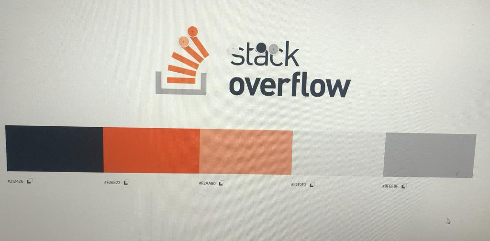

# DevDoubt

## Índice

- [1. Resumo do Projeto](#1-resumo-do-projeto)
- [2. Definição do Projeto](#2-definição-do-projeto)
- [3. Planejamento e Organização](#3-planejamento-e-organização)
- [4. Protótipo de baixa fidelidade](#4-protótipo-de-baixa-fidelidade)
- [5. Protótipo de alta fidelidade](#5-protótipo-de-alta-fidelidade)
- [6. Paleta de Cores](#6-paleta-de-cores)
- [7. Histórias de usuários](#6-histórias-de-usuários)
- [8. Testes de Usabilidade](#7-testes-de-usabilidade)
- [9. Tecnologias Utilizadas](#8-tecnologias-utilizadas)
- [10. Considerações](#9-considerações)

***

## 1. Resumo do projeto.

**_DevDoubt_** foi pensado e desenvolvido com a intenção de ajudar os programadores profissionais e os intusiastas a encontrarem respostas para suas dúvidas de forma mais rápida e prática.

Como sabemos, a internet possue uma infinidade de informações, e muitas vezes, para conseguir filtrar essas informações, acaba demandando um bom tempo de experiência, sendo assim, decidimos unir em um só lugar as melhores soluções para seus Bugs ou até mesmo aperfeiçoamento de seu código.

## 2. Definição do Projeto.

O site foi desenvolvido para que o usuário possa navegar de forma simples e prática.

Nossa inspiração para a criação do nosso app, foi o renomado site [Stack Overflow](https://pt.stackoverflow.com/).

A nossa missão foi criar uma [Single-page
Application
(SPA)](https://pt.wikipedia.org/wiki/Aplicativo_de_p%C3%A1gina_%C3%BAnica) que fosse responsiva e com mais de uma tela, onde o usuário pudessse criar uma conta de acesso,
logar-se com ela, criar, editar, deletar e dar likes em publicações.

## 3. Planejamento e Organização.

O projeto foi desenvolvido por [_Fernanda Monteiro_](https://github.com/Fe-Monteiro), [_Leticia Antunes_](https://github.com/leticiaantunesjpeg) e [_Thaís Bonalume_](https://github.com/moreirathais) uma equipe incrível, sendo nosso terceiro projeto a ser realizado no Bootcamp na turma SAP007, no qual a principal ferramenta utilizada para nossa organização foi o Trello.

Nele trabalhamos cada história de usuário e esmiuçamos em Baby Steps, o que facilitou muito a nossa comunicação e desenvolvimento.

Outro ponto bastante positivo, foi que procuramos fazer o projeto na sua grande maioria em pair programming, o que nos ajudou a chegarmos ainda mais no resultado esperado.

## 4. Protótipo de baixa fidelidade.

Foi esboçado à princípio um projeto em folha de papel, para que pudéssemos juntar as ideias, após, fizemos um protótipo utilizando a ferramenta do Figma.
Houve algumas pequenas mudanças, mas buscamos manter a idéia original.

### Protótipo de baixa fidelidade feita à mão em folha de papel

### Protótipo de baixa fidelidade feita na ferramenta do Figma

## 5. Protótipo de alta fidelidade.

O protótipo de alta fielidade foi desenvolvido na ferramenta do Figma.

## 6. Paleta de Cores.

Nossa paleta de cores foi inspirada no reconhecido site Stack Overflow.

## 7. Histórias de usuários.

**1**. "Como desenvolvedor, gostaria de poder navegar pelo app e encontrar diversas soluções de problemas".

#### Critérios de aceitação:
- [x] Interface que exiba as soluções postadas.
- [x] Visualização da página que está navegando.

#### Definição de Pronto:

- Página HTML que exiba as soluções postadas.
- Estilização conforme protótipo e responsividade.
- Testes unitários e de usabilidade.
- Implementação.

**2**. "Como usuário tendo contato com a aplicação pela primeira vez, gostaria de acessar e saber do que se trata".

#### Critérios de aceitação:
- [x] Interface que defina a finalidade da aplicação.
- [x] Opção de login.

#### Definição de Pronto:

- Página HTML que exiba o slogan.
- Inputs de entrada.
- Estilização conforme protótipo e responsividade.
- Testes unitários e de usabilidade.
- Implementação.

**3**. "Como usuário interessado no conteúdo da página, gostaria de efetuar o cadastro para login de acesso".

#### Critérios de aceitação:
- [x] Opção de cadastro.
- [x] Validação do usuário sem repetição.
- [x] Validação do email.
- [x] Validação da senha de modo oculto.
- [x] Voltar para a página de login.

#### Definição de Pronto:

- Campos de preenchimento.
- Autenticações.
- Estilização conforme protótipo e responsividade.
- Testes unitários e de usabilidade.
- Implementação.

**4**. "Como usuário da rede social, desejo acessar o aplicativo com a conta Google para um acesso mais rápido".

#### Critérios de aceitação:
- [x] Opção de login com Google.
- [x] Validação da conta Google.

#### Definição de Pronto:

- Botão clicável que autentique conta Google e dá acesso ao aplicativo.
- Estilização conforme protótipo e responsividade.
- Testes unitários e de usabilidade.
- Implementação.

**5**. "Como usuário da rede social, gostaria de acessar com meu e-mail e senha".

#### Critérios de aceitação:
- [x] Opção de login.
- [x] Verificar se o usuário está logado.

#### Definição de Pronto:

- Botão clicável que permita o login e autentique.
- Estilização conforme protótipo e responsividade.
- Testes unitários e de usabilidade.
- Implementação.

**6**. "Como usuário da rede social, gostaria de postar uma solução encontrada para ajudar outros desenvolvedores".

#### Critérios de aceitação:
- [x] Campo de postagem.
- [x] Campo para título e texto.
- [x] Botão de postagem.

#### Definição de Pronto:

- Botão postar funcional.
- Campos de texto com validação de conteúdo.
- Estilização conforme protótipo e responsividade.
- Testes unitários e de usabilidade.
- Implementação.
- Guardar postagens no banco de dados.

**7**. "Como usuário da rede social, gostaria de editar ou deletar a minha postagem".

#### Critérios de aceitação:
- [x] Opção editar que altere a forma de visualização.
- [x] Opção deletar que confirme a exclusão.

#### Definição de Pronto:

- Botões de editar e deletar no perfil.
- Campos de texto com validação de conteúdo.
- Estilização conforme protótipo e responsividade.
- Testes unitários e de usabilidade.
- Implementação.
- Guardar as alterações no banco de dados.

**8**. "Como usuário da rede social, gostaria de curtir postagens de outros usuários".

#### Critérios de aceitação:
- [x] Opção de curtida única.
- [x] Contagem ativa das curtidas.
- [x] Exclusão da curtida.

#### Definição de Pronto:

- Botão de curtida.
- Ativação e inativação da curtida.
- Adição e subtração da curtida.
- Estilização conforme protótipo e responsividade.
- Testes unitários e de usabilidade.
- Implementação.

## 8. Testes de usabilidade.

Foram realizados testes de usabilidades com pessoas de diferentes faixas etárias:

***Usuários adultos na faixa de idade de 30-40 anos:***

- Achou poluído o layout quando havia vários botões de pesquisa.

Solução: Fiz os botões com opções suspensas.

- Gostaria que ao clicar nos filtros, os cards já aparecessem, sem que houvesse a necessidade de clicar em algum botão para processar o filtro.

Solução: Retirei o botão de filtrar, que deveria recarregar o filtro selecionado após o clique, e coloquei a opção "change" que recarrega os cards assim que o filtro é selecionado.

## 9. Tecnologias Utilizadas.
- HTML 5
- CSS3
- JavaScript Vanilla
- Node.js
- Git
- GitHub
- GitHUb Pages
- Jest
- FIrebase

## 10. Considerações.

DevDoubt foi desenvolvido em trio por, _Fernanda Monteiro_, _Leticia Antunes_ e _Thaís Bonalume_, alunas da turma SAP007 da <Laboratória>&#128155;.

Este projeto foi o nosso terceiro desafio do Bootcamp que nos ensinou sobre:
- Manipulação do DOM, Objetos e Array;
- Funções;
- Consumo de banco de dados externo;
- Firebase;
- Desenvolvimento de testes unitários;
- Responsividade;
- Single-page Application (SPA)
- UX Design;
- GitHub;
- Eslint;
- Aprendder a aprender;

Agradeço por esse grande desafio, pelo trio fantástico e pelo apoio das mentoras, psicólogas e colegas de squad.

- [ ] **Uso de HTML semântico**

  

Links

  * [HTML semántico](https://curriculum.laboratoria.la/pt/topics/html/02-html5/02-semantic-html)
  * [Semantics in HTML - MDN](https://developer.mozilla.org/en-US/docs/Glossary/Semantics#Semantics_in_HTML)

## 4. Considerações gerais

## 5. Critérios de aceitação mínimos do projeto

### 5.1 Boilerplate

Este projeto não inclui um _boilerplate_, portanto você terá que definir a
estrutura de pastas e escrever seus próprios testes unitários (_tests_). Para
isso, você pode guiar-se por meio de projetos anteriores.

### 5.2 Definição do produto

No `README.md`, conte-nos brevemente como você mapeou as necessidades dos seus
usuários e como você chegou à definição final do seu produto. É importante que
detalhe:

* Quem são os principais usuários do produto.
* Qual problema o produto resolve/para que ele serve para esses usuários.

### 5.3 Histórias de usuário

Depois de entender as necessidades de seus usuários, escreva as Histórias de
Usuário. Elas representam tudo o que ele precisa fazer/ver na Rede Social. Cada
uma de suas histórias de usuário deve possuir:

* **Critérios de aceitação:** tudo o que deve acontecer para satisfazer as
  necessidades do usuário.

* **Definição de pronto:** todos os aspectos técnicos que devem ser atendidos
  para que, como equipe, saibam que essa história está finalizada e pronta para
  ser publicada. **Todas** suas histórias de usuário (com exceções), devem
  incluir esses aspectos em sua definição de pronto (além de tudo o que precisa
  adicionar):

  - Ser uma SPA.
  - Ser _responsivo_.
  - Receber _code review_ de pelo menos uma parceira de outra equipe.
  - Fazer _tests_ unitários.
  - Fazer testes manuais buscando erros e imperfeições simples.
  - Fazer testes de usabilidade e incorporar o _feedback_ dos usuários como
    melhorias.
  - Fazer deploy do aplicativo e marcar a versão (git tag).

### 5.4 Desenho da Interface de Usuário (protótipo de baixa fidelidade)

Você deve definir qual será o fluxo que o usuário seguirá dentro do seu
aplicativo e, com isso, criar a interface do usuário (UI) que siga este fluxo.

### 5.5 Responsivo

Deve funcionar bem em dispositivos de tela grande (computadores, laptops etc.) e
pequena (_tablets_, telefones celulares etc.). Sugerimos seguir a técnica
_`mobile first`_ (mais detalhes sobre essa técnica ao final).

### 5.6 Considerações sobre o comportamento da Interface do Usuário (UI)

Essas considerações ajudarão você a escrever as definições de pronto de sua
H.U.:

#### Criação e login de conta de usuário

* _Login_ com Firebase:
  - Para o _login_ e postagens na timeline, você pode usar o
    [Firebase](https://firebase.google.com/products/database/)
  - O usuário deve poder criar uma conta de acesso ou autenticar-se com conta de
    e-mail e senha e também com uma conta do Google.
* Validações:
  - Somente usuários com contas válidas têm acesso permitido.
  - Não haver usuários repetidos.
  - A conta do usuário deve ser um email válido.
  - O que o usuário digita no campo de senha (_input_) deve ser secreto.
* Comportamento:
  - Quando o formulário de registro ou login é enviado, ele deve ser validado.
  - Se houver erros, mensagens descritivas devem ser exibidas para ajudar o
    usuário.

#### Timeline/linha do tempo

* Validações:
  - Ao publicar, deve ser validado se há conteúdo no _input_.
* Comportamento:
  - Ao recarregar o aplicativo, é necessário verificar se o usuário está
    _logado_ antes de exibir o conteúdo,
  - Conseguir publicar um _post_.
  - Poder dar e remover _likes_ em uma publicação. Máximo de um por usuário.
  - Visualizar contagem de _likes_.
  - Poder excluir uma postagem específica.
  - Solicitar confirmação antes de excluir um _post_.
  - Ao clicar em editar um _post_, você deve alterar o texto para um _input_ que
    permite editar o texto e salvar as alterações.
  - Ao salvar as alterações, você deve voltar ao texto normal, mas com a
    informação editada.
  - Ao recarregar a página, poder ver os textos editados.

### 5.7 Considerações técnicas sobre front-end

* Separar a manipulação do DOM da lógica (separação de responsabilidades).
* Ter várias telas. Para isso, seu aplicativo deve ser um [Single Page
  Application
  (SPA)](https://pt.wikipedia.org/wiki/Aplicativo_de_p%C3%A1gina_%C3%BAnica)
* Alterar e persistir dados. Os dados que você adiciona ou modifica devem
  persistir por todo o aplicativo. Recomendamos que você use o
  [Firebase](https://firebase.google.com/) para isso também.

#### Testes unitários

* Lembre-se de que não há _setup_ de **testes** definido, isso dependerá da
  estrutura do seu projeto. Você não deve esquecer de pensar sobre os testes.
  Eles podem ajudar a definir a estrutura e sua lógica.

* Os testes de unidade devem cobrir no mínimo 70% de _statements_, _functions_,
  _lines_ e _branches_.

### 5.8 Considerações técnicas UX

* Faça pelo menos 2 entrevistas com os usuários.
* Faça um protótipo de baixa fidelidade.
* Verifique se a implementação do código segue as diretrizes do protótipo.
* Faça sessões de teste de usabilidade com o produto em HTML.

## 6. Hacker Edition

As seções chamadas _Hacker Edition_ são **opcionais**. Se **você terminou** e
cumpriu todos os requisitos acima e sobrou tempo, tente concluí-las. Dessa
forma, você pode aprofundar e/ou exercitar mais os objetivos de aprendizagem do
projeto.

* Criar posts com imagens.
* Procurar usuários, adicionar e excluir "amigos".
* Definir a privacidade de _posts_ (público ou apenas para amigos).
* Permitir ver na linha do tempo de usuários "não amigos" apenas os posts
  públicos.
* Permitir comentar ou responder a uma postagem.
* Editar perfil.

## 7. Entrega

O projeto será entregue subindo seu código no GitHub (`commit` /`push`) e a
interface será hospedada usando o GitHub pages ou outro serviço de hospedagem
que você pode ter encontrado ao longo do caminho.

***

## 8. Guias, dicas e leituras complementares

### Mobile first

O conceito de [_mobile
first_](https://tableless.com.br/mobile-first-a-arte-de-pensar-com-foco/) faz
referência a um processo de desenho e desenvolvimento que parte de como se vê e
como funciona uma aplicação primeiro em um dispositivo móvel e mais adiante se
analisa como adaptar a aplicação à telas progressivamente maiores. Esta é uma
contraposição ao modelo tradicional, no qual primeiro se desenha os websites (ou
webapps) para desktops e depois os adaptam para telas menores.

A motivação aqui é se assegurar que desde o começo sejam desenhadas telas
_responsivas_. Dessa forma, começamos com a aparência e o comportamento do
aplicativo em uma tela e ambiente móvel.

### Múltiplas telas

Em projetos anteriores, nossas aplicações eram compostas de apenas uma tela
_principal_ (uma só _página_). Neste projeto, precisaremos dividir nossa
interface em várias _views_ ou _pages_ e oferecer uma maneira de navegar entre
essas telas. Esse problema pode ser resolvido de várias maneiras: com arquivos
HTML independentes (cada um com seu próprio URL) e links tradicionais; mantendo
na memória e renderizando condicionalmente (sem atualizar a página);
[manipulando o histórico do
navegador](https://developer.mozilla.org/pt-BR/docs/Web/API/History_API)
com
[`window.history`](https://developer.mozilla.org/pt-BR/docs/Web/API/Window/history).
Neste projeto, convidamos você a explorar opções e decidir sobre uma opção de
implementação.

### Gravação de dados

Nos projetos anteriores, consumimos dados, mas ainda não tínhamos escrito dados
(salvar alterações, criar dados, excluir, etc). Neste projeto, você precisará
criar (salvar) novos dados, além de ler, atualizar e modificar os dados
existentes. Esses dados podem ser salvos remotamente usando o
[Firebase](https://firebase.google.com/).

Outras:

* [Mobile
  First](https://tableless.com.br/mobile-first-a-arte-de-pensar-com-foco/)
* [Mobile First Is NOT Mobile Only - Nielsen Norman
  Group](https://www.nngroup.com/articles/mobile-first-not-mobile-only/)
* [Flexbox - CSS
  Tricks](https://css-tricks.com/snippets/css/a-guide-to-flexbox/)
* [Módulos:
  Export](https://developer.mozilla.org/pt-BR/docs/Web/JavaScript/Reference/Statements/export)
* [Módulos:
  Import](https://developer.mozilla.org/es/docs/Web/JavaScript/Referencia/Sentencias/import)
