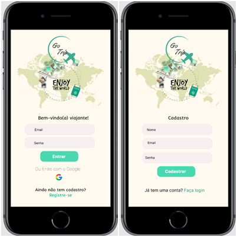

# Go Trip - Social Network para amantes de viagens

---

## Índice

- [1. Introdução](#1-introdução)
- [2. Histórias de Usuários](#2-histórias-de-usuários)
- [3. Interface](#3-interface)
- [4. Objetivos de Aprendizagem](#4-objetivos-de-aprendizagem)
- [5. Ferramentas Utilizados](#7-ferramentas-utilizadas)

## 1. Introdução

As redes sociais invadiram nossas vidas. Nós as amamos ou odiamos, e muitas pessoas não conseguem viver semelas.
Há redes sociais de todo tipo para todos os tipos de interesse. Por exemplo: em uma rodada de financiamento com investidores, foi apresentada uma rede social para químicos onde os usuários podem publicar artigos a respeito de suas pesquisas, comentar os artigos de seus colegas e filtrar artigos de acordo com determinadas tags ou popularidade, mais recente ou mais comentado.

## 2. Histórias de usuários

O Go Trip é uma rede social direcionada a pessoas que tenham o desejo de compartilhar suas experiências e dar dicas de viagens ou para pessoas que está buscando a sua primeira aventura seja ela sozinho ou em grupo e buscar informações relevantes que enriqueça o seu planejamento de viagem. Para atender a necessidade do público, foram identificadas 3 histórias de usuários e a seguir foram extraidos os critérios de aceitação para desenvolver a nossa Single Page Application.

Segundo o _Dev Média_: "Single Page Applications (SPA) são aplicações cuja funcionalidade está concentrada em uma única página. Ao invés de recarregar toda a página ou redirecionar o usuário para uma página nova, apenas o conteúdo principal é atualizado de forma assíncrona, mantendo toda a estrutura da página estática."

### História 1
Eu como viajante gostaria de interagir em uma rede social destinada para tal finalidade onde possa me conectar com outras pessoas e para isso é necessário fazer login com email e senha válidos.
### História 2
(Descrever)
### História 3
(Descrever)

## 3. Interface

A interface do projeto foi desenhada para atender uma SPA(Single Page Application), que contém ao todo 3 páginas, sendo elas de login, cadastro e timeline.

A paleta de cores foi extraida da imagem principal da aplicação.

### Protótipos

**Baixa Fidelidade**

**Alta Fidelidade**

O protótipo de alta fidelidade foi desenvolvido atráves da ferramenta Figma, onde foram desenvolvidas as páginas que mostram o layout das 3 interface criadas em telas mobile, tablet e desktop.

## 4. Objetivos de Aprendizagem

## 5. Considerações finais
### Ferramentas utilizadas
- Vs Code
- Trello
- Firebase
- Figma
- Canva
- Google Forms

### Densenvolvido por:
- Camia Aguiar 
- Érika Moreno 
- Fernanda Leandra