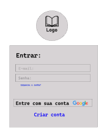
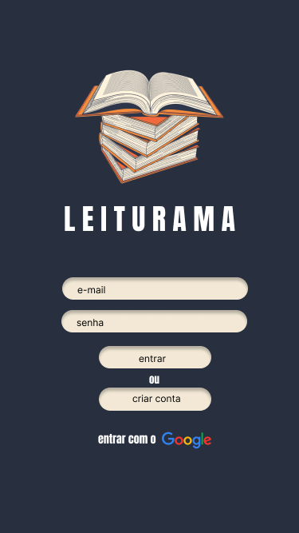
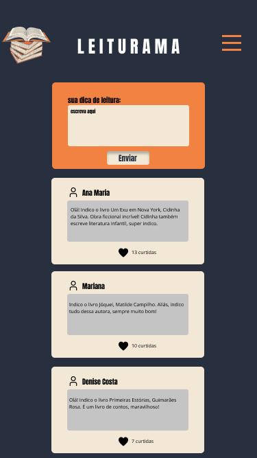
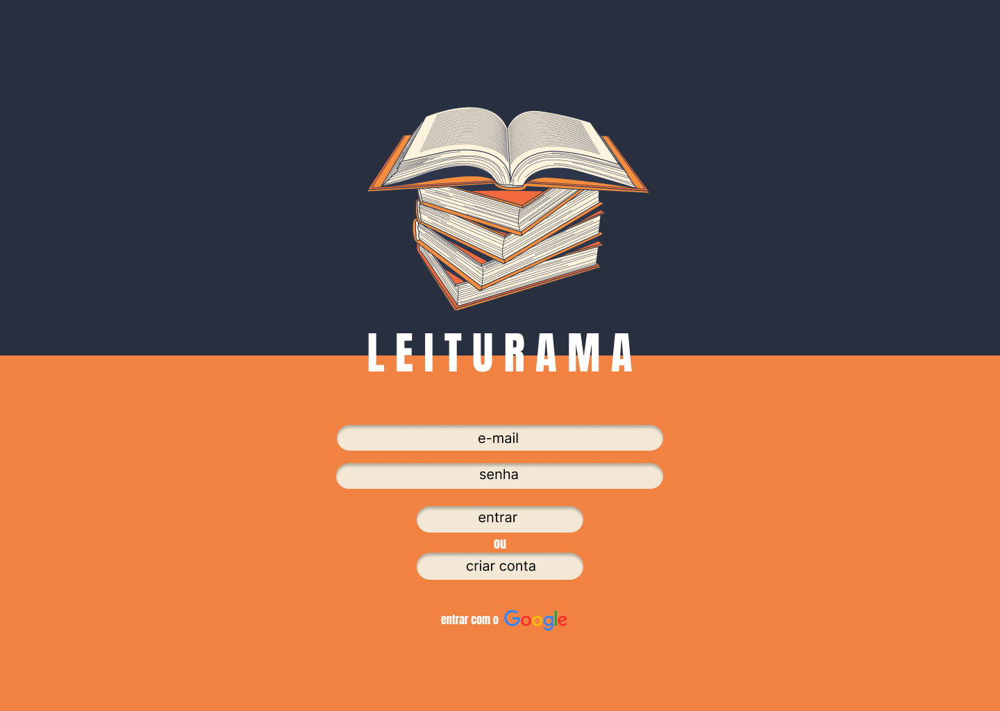

# Leiturama

## Índice

* [1. Sobre o projeto](#1-sobre-o-projeto)
* [2. Desenvolvedoras](#2-desenvolvedoras)
* [3. Interface do usuário](#3-interface-do-usuário)
* [4. Tecnologias Utilizadas](#4-tecnologias-utilizadas)
* [5. Como usar](#5-como-usar)

***

## 1. Sobre o projeto

Leiturama é a rede social (Single Page Aplication) criada para qualquer pessoa que tenha gosto pela leitura. A ideia é simples: usuários podem compartilhar dicas de leitura e interagir com posts de outros usuários. Além disso, qualquer usuário pode criar uma conta de acesso,logar-se com ela, editar, deletar e dar _likes_ em publicações. [Acesse aqui!](https://larasantos97.github.io/SAP007-social-network/)

## 2. Desenvolvedoras

Este projeto foi desenvolvido por [Jessika Mirella](https://github.com/JessikaMirella),[Larissa Santos](https://github.com/Larasantos97) e [Wayra Arendartchuk](https://github.com/WayraArendartchukCastro), alunas da sétima geração do Bootcamp Laboratória Br.

## 3. Interface do usuário

Desenvolvemos os protótipos de baixa e alta fidelidade através da plataforma Figma, levando em consideração o conceito Mobile First.

 
 

### - Protótipo de baixa fidelidade

 
 

### - Protótipo de alta fidelidade
 

#### Mobile Login

 
 

#### Mobile Feed

#### Desktop Login

 
 

## 4. Tecnologias utilizadas

- Trello
- Figma
- HTML5
- CSS3
- JavaScript Vanilla
- Firebase
- Node.js
- Git e GitHub

## 5. Como usar
Você precisará usar o Node.js

Clonar o projeto

` $ git clone https://github.com/Larasantos97/SAP007-social-network`

Instalar as dependências do projeto

` $ npm install or yarn`

Iniciar a aplicação

` $ npm start or yarn start`

Realizar os testes unitários

` $ npm test or yarn test`

