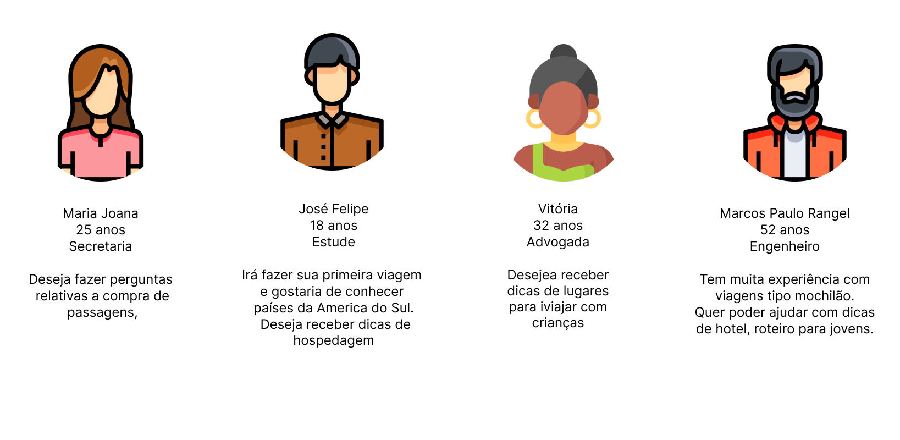
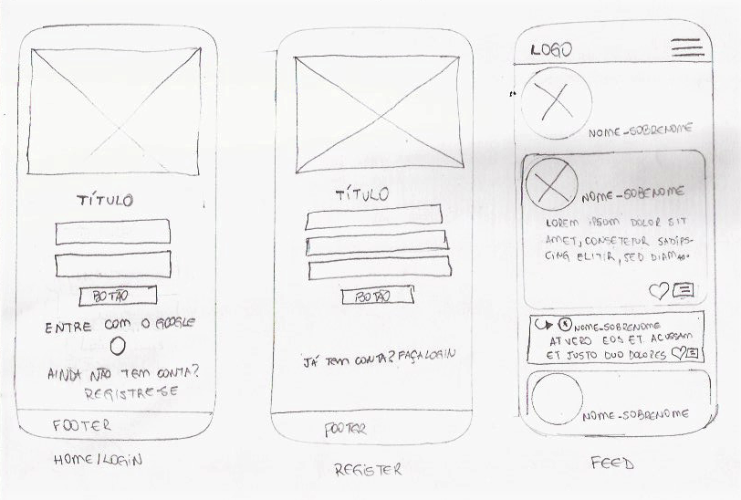

   # Go Trip - Social Network para amantes de viagens
## Índice

- [1. Introdução](#1-introdução)
- [2. Histórias de Usuários](#2-histórias-de-usuários)
- [3. Interface](#3-interface)
- [4. Objetivos de Aprendizagem](#4-objetivos-de-aprendizagem)
- [5. Ferramentas Utilizados](#7-ferramentas-utilizadas)

## 1. Introdução
---
As redes sociais invadiram nossas vidas. Nós as amamos ou odiamos, e muitas pessoas não conseguem viver semelas.
Há redes sociais de todo tipo para todos os tipos de interesse. Por exemplo: em uma rodada de financiamento com investidores, foi apresentada uma rede social para químicos onde os usuários podem publicar artigos a respeito de suas pesquisas, comentar os artigos de seus colegas e filtrar artigos de acordo com determinadas tags ou popularidade, mais recente ou mais comentado.

## 1.1 Produto

O Go Trip é uma rede social direcionada a pessoas que tenham o desejo de compartilhar suas experiências e dar dicas de viagens ou para pessoas que está buscando a sua primeira aventura seja ela sozinho ou em grupo e buscar informações relevantes que enriqueça o seu planejamento de viagem. Para atender a necessidade do público, foram identificadas 3 histórias de usuários e a seguir foram extraidos os critérios de aceitação para desenvolver a nossa Single Page Application.

Segundo o _Dev Média_: "Single Page Applications (SPA) são aplicações cuja funcionalidade está concentrada em uma única página. Ao invés de recarregar toda a página ou redirecionar o usuário para uma página nova, apenas o conteúdo principal é atualizado de forma assíncrona, mantendo toda a estrutura da página estática."

OBS: Para testar a aplicação sem que seja necessário criar um usuário basta entrar com o seguinte email:  teste@teste.com e senha: 123456.
## 2. Histórias de usuários
---
### História 1
> "Como viajante iniciante gostaria de interagir em uma rede social destinada para tal finalidade onde possa me conectar com outras pessoas para sanar minhas dúvidas referente ao tema da rede social e para isso é necessário fazer cadastro de usuário com email e senha válidos."
### História 2
> "Eu como um viajante experiente gostaria de acessar a rede social com meu email e senha válidos e poder compartilhar através de publicações minhas experiências de viagens."
### História 3
> "Desejo me conectar com outras pessoas e tirar minhas dúvidas e curtir/dar like em publicações que possuem relevância para mim."

## 2.1 Personas 
---
 

    
  

## 3. Interface
---
### 3.1 Paleta de Cores
A interface do projeto foi desenhada para atender uma SPA(Single Page Application), que contém ao todo 3 páginas, sendo elas de login, cadastro e timeline.

A paleta de cores foi extraida da imagem principal da aplicação.

## 4 Protótipos
---
Para o desenvolvimento do protótipo de alta fidelidade, foi usado uma ferramenta digital para protótipo. A ferramenta utilizada foi o Figma, que é um editor gráfico de vetor e prototipagem de projetos de design baseado principalmente no navegador web.
### 4.1 Protótipo de Baixa Fidelidade
---

### 4.2 Protótipo de Alta Fidelidade
---
O protótipo de alta fidelidade foi desenvolvido atráves da ferramenta Figma, onde foram desenvolvidas as páginas que mostram o layout das 3 interface criadas em telas mobile, tablet e desktop.

## 4. Teste de Usabilidades
---
## 5. Considerações finais
---
### Ferramentas utilizadas
- Vs Code
- Trello
- Firebase
- Figma
- Canva
- Google Forms
### Densenvolvido por:
---
<table>
<td>
  

     
  

  <h3 align="center"><a href="https://github.com/Cahaguiar" target="_blank">Camila Aguiar</a></h3>
  

    
    
  

</td>

<td>
  

     
  

  <h3 align="center"><a href="https://github.com/erikakrause" target="_blank">Érika Moreno</a></h3>
  

    
    
  

</td>
 
<td>
  

     
  

  <h3 align="center"><a href="https://github.com/Fernanda741" target="_blank">Fernanda Leandra</a></h3>
  

    
     
  

</td>
</table>
<table>
