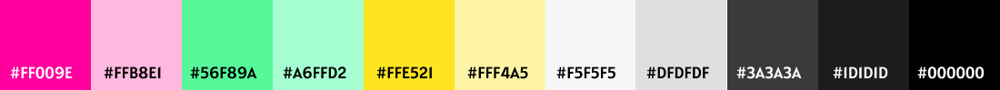

   

## LabFriends é uma rede social para alunas do bootcamp da Laboratoria.

**Status do Projeto:** _Em Andamento_
  
**Deploy:** 

---

## ÍNDICE

- [1. INTRODUÇÃO](#1-introdução)
- [2. HISTÓRIAS DE USUÁRIOS](#2-histórias-de-usuários)
  - [2.1. Critérios de Aceitação](#21-critérios-de-aceitação)
  - [2.2. Definição de Pronto](#22-definição-de-pronto)
- [3. PROTÓTIPOS](#3-protótipos)
  - [3.1. UX (Experiência do Usuário) e UI (Design de Interface)](#31-ux-experiência-do-usuário-e-ui-design-de-interface)
- [4. PROTÓTIPOS](#4-protótipos)
  - [4.1. Protótipo de Baixa Fidelidade](#41-protótipo-de-baixa-fidelidade)
  - [4.2. Protótipos de Alta Fidelidade](#42-protótipos-de-alta-fidelidade)
- [5. TESTES DE USABILIDADE](#5-testes-de-usabilidade)
- [6. AUTORAS](#6-autoras)

---
   
## 1. INTRODUÇÃO
   
LabFriends é uma rede social interna destinada para todas alunas do bootcamp da _*[Laboratoria](https://www.laboratoria.la/br)*_ do primeiro semestre de 2022, com objetivo de mantê-las conectadas, mesmo após o término do bootcamp, além de ampliar a sua rede de contato profissional. 

Todas as usuárias terão um perfil editável, com informações pessoais relacionados a área de programação e também poderão criar, editar e excluir suas postagens visualizadas em sua linha do tempo (timeline), além de comentar e curtir posts das demais usuárias. Por fim, a LabFriends contará com uma área específica, onde trará uma lista contendo: o seu nome social, a sua foto e uma breve descrição de sua vida pessoal e profissional, podendo encontrar uma usuária específica por meio da pesquisa com seu nome.

O diferencial dessa rede social é que todas as mulheres que se cadastrarem, serão automaticamente conectadas com as demais existentes na LabFriends, não havendo necessidade de encontrar usuárias individualmente para solicitar a sua amizade online. Assim, todas as usuárias poderão se conectar com maior número de alunas,  para buscar informações pertinentes enquanto as mesmas estão cursando o bootcamp e até mesmo para dúvidas profissionais após o seu término.

## 2. HISTÓRIAS DE USUÁRIOS

> "Como amante de rede social e aluna da Laboratoria quero uma rede social para que eu possa conectar com as minhas colegas da Lab, fora do horário do bootcamp. Desejo ter mais momentos de [happy hour](https://pt.wikipedia.org/wiki/Happy_hour) com elas e também poder tirar dúvidas sobre programação ou ajudar as minhas colegas. Quero uma aplicação que eu possa acessar em qualquer dispositivo, desde celular, tablet e notebook e que eu possa clicar em qualquer parte do site para criar as minhas postagens."

> "Eu, como aluna da Lab (Laboratoria), desejo manter contato com as minhas colegas de bootcamp e também as demais de outras turmas formadas anteriormente, para tirar dúvidas sobre a carreira de programação e também de assuntos do próprio bootcamp. Também quero para ter momentos de entretenimento com as minhas colegas fora do horário do bootcamp."

### 2.1. Critérios de Aceitação

   - Permitir que somente as estudantes façam parte da LabFriends.
   - Ter todos os dados salvos no site.
   - Permitir que o perfil de cada usuária seja editável.
   - Poder postar, editar, apagar e comentar postagens pessoais e de terceiros.

### 2.2. Definição de Pronto 

   - Referente aos aspectos técnicos apontados no README da Laboratoria.

      - Ser uma SPA.
      - Ser responsivo.
      - Receber code review de pelo menos uma parceira de outra equipe.
      - Fazer testEs unitários.
      - Fazer testes manuais buscando erros e imperfeições simples.
      - Fazer testes de usabilidade e incorporar o feedback dos usuários como melhorias.
      - Fazer deploy do aplicativo e marcar a versão (git tag).
   
## 3. PROTÓTIPOS

### 3.1. UX (Experiência do Usuário) e UI (Design de Interface)
   
- _**Estilo**_

  - A aplicação será baseada no estilo, tipografia e cores pertencentes ao design da Laboratoria. O estilo aplicado é o _**[flat design](https://www.chiefofdesign.com.br/ui-design/)**_, reduzido em formas planas, sem sombreamento, sem texturas e reflexos, sendo focado nos conteúdos e em uma navegação mais simples em linhas retas.

- _**Mapa do Site**_

  - A estrutura do site seguirá usando o conceito de SPA [(Single Page Application)](https://pt.wikipedia.org/wiki/Aplicativo_de_p%C3%A1gina_%C3%BAnica), obedecendo a seguinte estrutura do site:

     

        
     

- _**Responsividade**_

    - Os tamanhos de telas utilizados no site, foram escolhidos segundo as estatísticas encontradas no site Statcounter, com base em dados coletados mundialmente. Os aparelhos eletrônicos escolhidos foram: [smartphone](https://pt.wikipedia.org/wiki/Smartphone), [tablet](https://pt.wikipedia.org/wiki/Tablet) e [desktop](https://en.wikipedia.org/wiki/Desktop_computer), que são:

      - _**Smartphone na posição vertical:**_ 360 x 640 pixels
      - _**Smartphone na posição horizontal:**_ 640 x 360 pixels
      - _**Tablet na posição vertical:**_ 600 x 962 pixels
      - _**Tablet na posição horizontal:**_ 962 x 600 pixels
      - _**Desktop:**_ 1280 x 720 pixels

   - Para utilizarmos no site, usaremos os seguintes intervalos de telas:

      - _**De 300px a 550px de largura**_ (para Smartphone)
      - _**De 550px a 1000px de largura**_ (para Tablet)
      - _**De 1000px a 1800px de largura**_ (para Desktop)
      - _**De 1800px a 2600px de largura**_ (para Desktop)

- _**Tipografia e Hierarquia**_

  - A [tipografia](https://www.chiefofdesign.com.br/tipografia/) escolhida possui fonte sem serifa, com a font-family: Arial, Verdana, Helvetica e Sans-Serif. São letras fáceis de serem visualizadas e lidas em aplicações da web. Para frases em destaque, serão usadas fonte com serifa, como: Times New Roman, Georgia e Garamond.

   - Para visualizar a hierarquia, foi usado fontes grandes para títulos de páginas. Já para destacar mais de um título em uma mesma página, o tamanho das letras serão padronizadas conforme o assunto abordado em seu conteúdo. Por fim, os demais textos, obedecem a hierarquia em relação ao título da página e ao tipo de tela em que será exibido.

- _**Cores e Contrastes**_

  - As cores em destaque serão feitas pelas cores: rosa, amarelo e verde, usados para detalhes como em botões, títulos e outros detalhes de destaque. Já as cores neutras, como: cinza, branco e preto, são usados para planos de fundo e letras, pois, facilita o contraste para a leitura em telas.

     

        
     

## 4. PROTÓTIPOS

- Para o desenvolvimento do protótipo de alta fidelidade, foi usado uma ferramenta digital para protótipo. A ferramenta utilizada foi o Figma, que é um editor gráfico de vetor e prototipagem de projetos de design baseado principalmente no navegador web.

### 4.1. Protótipo de Baixa Fidelidade

  

### 4.2. Protótipos de Alta Fidelidade

#### 4.2.1 Protótipo para telas com largura entre 300 pixels a 550 pixels

  

#### 4.2.2. Protótipo para telas com largura entre 550 pixels a 1.000 pixels

  

#### 4.2.3. Protótipo para telas com largura acima de 1.000 pixels

  

## 5. TESTES DE USABILIDADE

## 6. AUTORAS

<table>
<td>
  

     
  

  <h3 align="center"><a href="https://github.com/adrianatwatanabe">Adriana Tiemi Watanabe</a></h3>
  <h4 align="center">Projeto do Bootcamp da <em><a href="https://hub.laboratoria.la/br">Laboratoria</a></em></h4>
  

    
    
  

</td>

<td>
  

     
  

  <h3 align="center"><a href="https://github.com/Maryssun">Dayanne Maryssol de Andrade Almeida</a></h3>
  <h4 align="center">Projeto do Bootcamp da <em><a href="https://hub.laboratoria.la/br">Laboratoria</a></em></h4>
  

    
  

</td>

<td>
    

     
  

  <h3 align="center"><a href="https://github.com/RaynaraPimenta">Raynara Pimenta</a></h3>
  <h4 align="center">Projeto do Bootcamp da <em><a href="https://hub.laboratoria.la/br">Laboratoria</a></em></h4>
  

    
    
  

   
</td>

</table>
