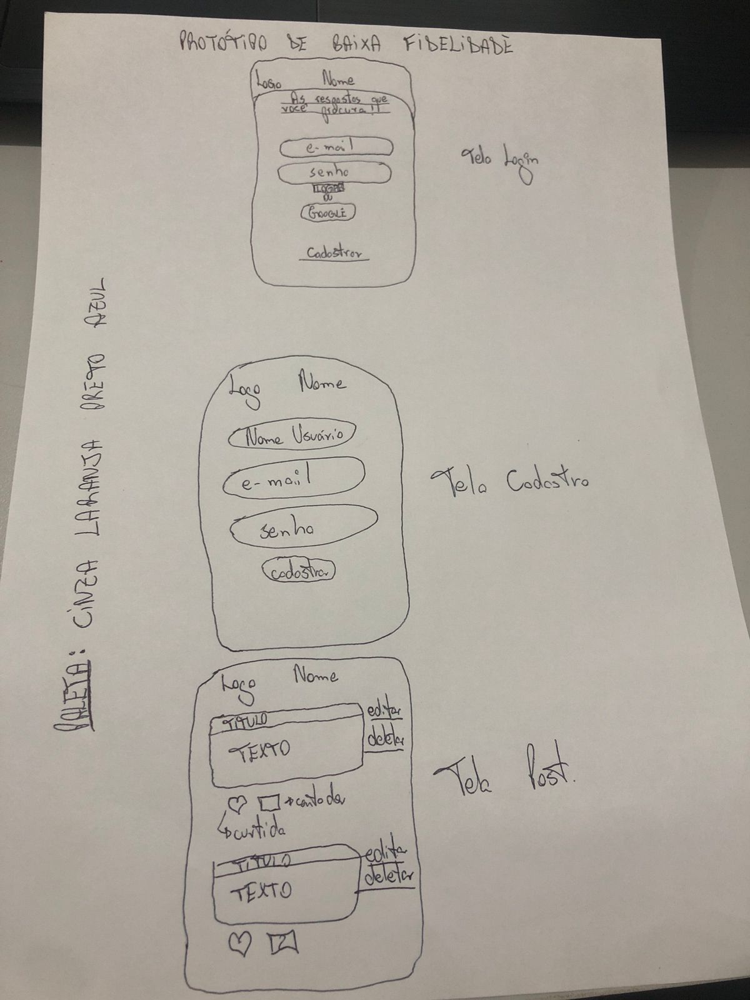
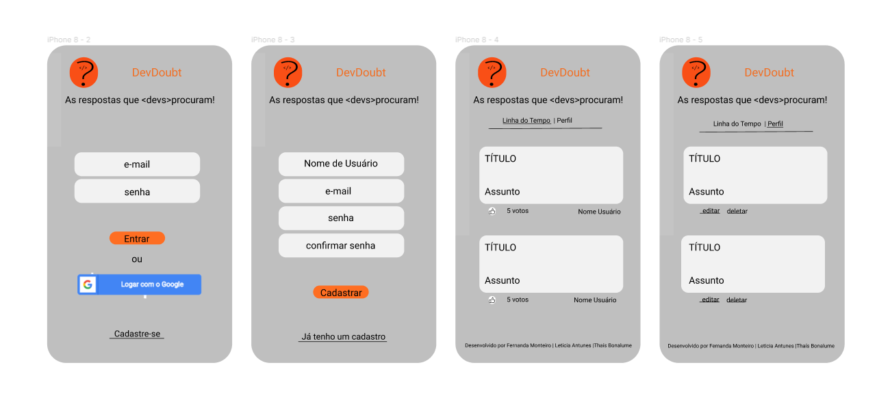
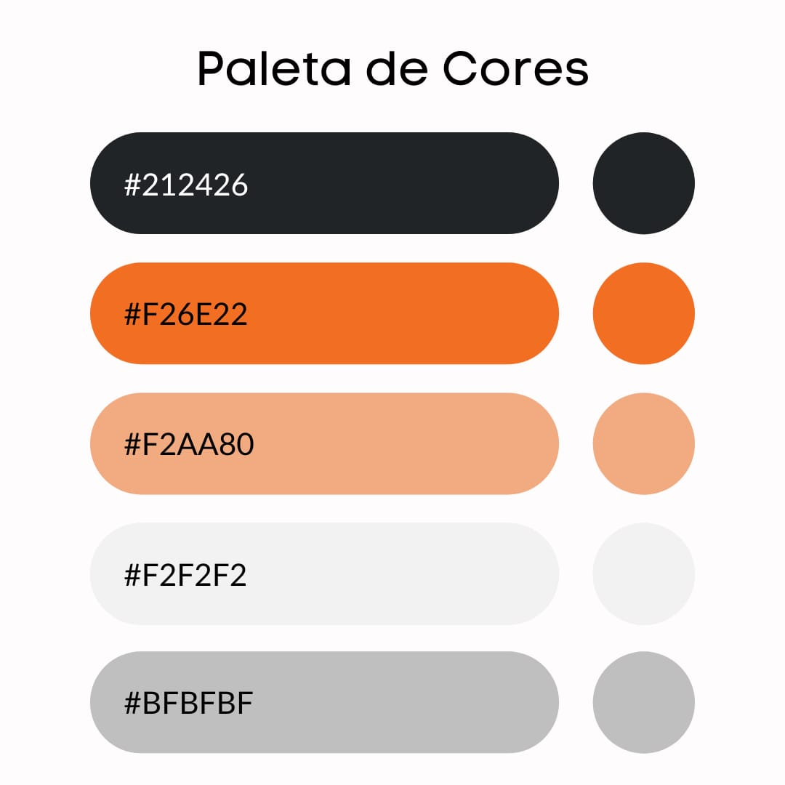

# DevDoubt

## Índice

- [1. Resumo do Projeto](#1-resumo-do-projeto)
- [2. Definição do Projeto](#2-definição-do-projeto)
- [3. Planejamento e Organização](#3-planejamento-e-organização)
- [4. Protótipo de baixa fidelidade](#4-protótipo-de-baixa-fidelidade)
- [5. Protótipo de alta fidelidade](#5-protótipo-de-alta-fidelidade)
- [6. Paleta de Cores](#6-paleta-de-cores)
- [7. Histórias de usuários](#6-histórias-de-usuários)
- [8. Testes de Usabilidade](#7-testes-de-usabilidade)
- [9. Tecnologias Utilizadas](#8-tecnologias-utilizadas)
- [10. Considerações](#9-considerações)

***

## 1. Resumo do projeto.

**_DevDoubt_** foi pensado e desenvolvido com a intenção de ajudar os programadores profissionais e os intusiastas a encontrarem respostas para suas dúvidas de forma mais rápida e prática.

Como sabemos, a internet possue uma infinidade de informações, e muitas vezes, para conseguir filtrar essas informações, acaba demandando um bom tempo de experiência, sendo assim, decidimos unir em um só lugar as melhores soluções para seus Bugs ou até mesmo aperfeiçoamento de seu código.

## 2. Definição do Projeto.

O site foi desenvolvido para que o usuário possa navegar de forma simples e prática.

Nossa inspiração para a criação do nosso app, foi o renomado site [Stack Overflow](https://pt.stackoverflow.com/).

A nossa missão foi criar uma [Single-page Application
(SPA)](https://pt.wikipedia.org/wiki/Aplicativo_de_p%C3%A1gina_%C3%BAnica) que fosse responsiva e com mais de uma tela, onde o usuário pudessse criar uma conta de acesso, logar-se com ela, criar, editar, deletar e dar likes em publicações.

## 3. Planejamento e Organização.

O projeto foi desenvolvido por [_Fernanda Monteiro_](https://github.com/Fe-Monteiro), [_Leticia Antunes_](https://github.com/leticiaantunesjpeg) e [_Thaís Bonalume_](https://github.com/moreirathais) uma equipe incrível, sendo nosso terceiro projeto a ser realizado no Bootcamp do <Laboratória> &#128155; na turma SAP007, no qual a principal ferramenta utilizada para nossa organização foi o Trello.

Nele trabalhamos cada história de usuário e esmiuçamos em Baby Steps, o que facilitou muito a nossa comunicação e desenvolvimento.

Outro ponto bastante positivo, foi que procuramos fazer o projeto na sua grande maioria em pair programming, o que nos ajudou a chegarmos ainda mais perto do resultado esperado.

## 4. Protótipo de baixa fidelidade.

Foi esboçado à princípio um projeto em folha de papel, para que pudéssemos juntar as ideias, após, fizemos um protótipo utilizando a ferramenta do Figma.
Houve algumas pequenas mudanças, mas buscamos manter a idéia original.

### Protótipo de baixa fidelidade feita à mão em folha de papel

### Protótipo de baixa fidelidade feita na ferramenta do Figma

## 5. Protótipo de alta fidelidade.

O protótipo de alta fielidade foi desenvolvido na ferramenta do Figma.

## 6. Paleta de Cores.

Nossa paleta de cores foi inspirada no reconhecido site Stack Overflow.

## 7. Histórias de usuários.

**1**. "Como desenvolvedor, gostaria de poder navegar pelo app e encontrar diversas soluções de problemas".

#### Critérios de aceitação:
- [x] Interface que exiba as soluções postadas.
- [x] Visualização da página que está navegando.

#### Definição de Pronto:

- Página HTML que exiba as soluções postadas.
- Estilização conforme protótipo e responsividade.
- Testes unitários e de usabilidade.
- Implementação.

**2**. "Como usuário tendo contato com a aplicação pela primeira vez, gostaria de acessar e saber do que se trata".

#### Critérios de aceitação:
- [x] Interface que defina a finalidade da aplicação.
- [x] Opção de login.

#### Definição de Pronto:

- Página HTML que exiba o slogan.
- Inputs de entrada.
- Estilização conforme protótipo e responsividade.
- Testes unitários e de usabilidade.
- Implementação.

**3**. "Como usuário interessado no conteúdo da página, gostaria de efetuar o cadastro para login de acesso".

#### Critérios de aceitação:
- [x] Opção de cadastro.
- [x] Validação do usuário sem repetição.
- [x] Validação do email.
- [x] Validação da senha de modo oculto.
- [x] Voltar para a página de login.

#### Definição de Pronto:

- Campos de preenchimento.
- Autenticações.
- Estilização conforme protótipo e responsividade.
- Testes unitários e de usabilidade.
- Implementação.

**4**. "Como usuário da rede social, desejo acessar o aplicativo com a conta Google para um acesso mais rápido".

#### Critérios de aceitação:
- [x] Opção de login com Google.
- [x] Validação da conta Google.

#### Definição de Pronto:

- Botão clicável que autentique conta Google e dá acesso ao aplicativo.
- Estilização conforme protótipo e responsividade.
- Testes unitários e de usabilidade.
- Implementação.

**5**. "Como usuário da rede social, gostaria de acessar com meu e-mail e senha".

#### Critérios de aceitação:
- [x] Opção de login.
- [x] Verificar se o usuário está logado.

#### Definição de Pronto:

- Botão clicável que permita o login e autentique.
- Estilização conforme protótipo e responsividade.
- Testes unitários e de usabilidade.
- Implementação.

**6**. "Como usuário da rede social, gostaria de postar uma solução encontrada para ajudar outros desenvolvedores".

#### Critérios de aceitação:
- [x] Campo de postagem.
- [x] Campo para título e texto.
- [x] Botão de postagem.

#### Definição de Pronto:

- Botão postar funcional.
- Campos de texto com validação de conteúdo.
- Estilização conforme protótipo e responsividade.
- Testes unitários e de usabilidade.
- Implementação.
- Guardar postagens no banco de dados.

**7**. "Como usuário da rede social, gostaria de editar ou deletar a minha postagem".

#### Critérios de aceitação:
- [x] Opção editar que altere a forma de visualização.
- [x] Opção deletar que confirme a exclusão.

#### Definição de Pronto:

- Botões de editar e deletar no perfil.
- Campos de texto com validação de conteúdo.
- Estilização conforme protótipo e responsividade.
- Testes unitários e de usabilidade.
- Implementação.
- Guardar as alterações no banco de dados.

**8**. "Como usuário da rede social, gostaria de curtir postagens de outros usuários".

#### Critérios de aceitação:
- [x] Opção de curtida única.
- [x] Contagem ativa das curtidas.
- [x] Exclusão da curtida.

#### Definição de Pronto:

- Botão de curtida.
- Ativação e inativação da curtida.
- Adição e subtração da curtida.
- Estilização conforme protótipo e responsividade.
- Testes unitários e de usabilidade.
- Implementação.

## 8. Testes de usabilidade.

Foram realizados testes de usabilidades com pessoas de diferentes faixas etárias:

***Usuários adultos na faixa de idade de 30-40 anos:***

- Achou poluído o layout quando havia vários botões de pesquisa.

Solução: Fiz os botões com opções suspensas.

- Gostaria que ao clicar nos filtros, os cards já aparecessem, sem que houvesse a necessidade de clicar em algum botão para processar o filtro.

Solução: Retirei o botão de filtrar, que deveria recarregar o filtro selecionado após o clique, e coloquei a opção "change" que recarrega os cards assim que o filtro é selecionado.

## 9. Tecnologias Utilizadas.
- HTML 5
- CSS3
- JavaScript Vanilla
- Node.js
- Git
- GitHub
- GitHUb Pages
- Jest
- FIrebase

## 10. Considerações.

DevDoubt foi desenvolvido em trio por, _Fernanda Monteiro_, _Leticia Antunes_ e _Thaís Bonalume_, alunas da turma SAP007 da <Laboratória> &#128155;.

Este projeto foi o nosso terceiro desafio do Bootcamp que nos ensinou sobre:
- Manipulação do DOM, Objetos e Array;
- Funções;
- Consumo de banco de dados externo;
- Firebase;
- Desenvolvimento de testes unitários;
- Responsividade;
- Single-page Application (SPA)
- UX Design;
- GitHub;
- Eslint;
- Aprender a aprender;

Agradeço por esse grande desafio, pelo trio fantástico e pelo apoio das mentoras, psicólogas e colegas de squad.